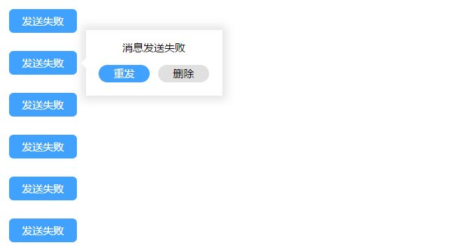

# vue-popup

[](https://travis-ci.org/beyoursun/vue-popup)
[](https://github.com/beyoursun/vue-popup/releases/tag/0.3.4)

> 一个 Vue.js 弹出框组件，供迅雷内部使用。受到 [Element Popover](http://element.eleme.io/#/zh-CN/component/popover) 的启发。



特性：

- 动态计算弹出框位置
- 边缘检测，保证弹出框边缘不会超出视区
- 单个弹出框可以匹配多个触发元素（多个元素写在同一模板下）

## 安装 Installation

### CDN

```html
<script src="//cdn.jsdelivr.net/gh/beyoursun/vue-popup/dist/vue-popup.js"></script>
```

### NPM

```bash
npm install @xunlei/vue-popup --save
```

## 使用 Usage

首选，你需要注册插件。

```js
import Vue from 'vue'
import VuePopup from 'vue-popup'

Vue.use(VuePopup)
```

在你的 `.vue` 文件中使用 `popup` 组件。

```html
<template>
  <div>
    <popup ref="popup1" :display.sync="showPop">
      <h3>标题</h3>
      <p>这是一段内容。</p>
    </popup>
    <a v-popup:popup1 href="javascript:;">展示弹出框</a>
  </div>
</template>

<script>
export default {
  data () {
    return {
      showPop: false
    }
  }
}
</script>
```

在你的 `popup` 组件上添加 `ref` 引用，然后使用 `v-popup` 指令来将按钮映射到弹出框上。`display` 特性用来配置弹出框是否可见。

这是一个简单的[在线示例](https://jsfiddle.net/bbsun/ftdtdu3r/)。

## 接口 API

### 属性 Prop

属性名 | 描述 | 类型 | 可选值 | 默认值
-- | -- | -- | -- | --
append-to-body | 是否放到 body 下 | Boolean | - | true
arrow-class | 箭头的类 | String | - | -
direction | 弹出框方向 | String | top/right/bottom/left | bottom
display (.sync) | 是否可见 | Boolean | - | false
padding | 弹出框与触发元素的间距 | Number | - | 0
trigger | 触发弹出框的事件类型 | String | hover/focus/click | hover
scroll-show | 页面滚动时弹出框是否可见 | Boolean | - | true 

### 事件 Event

事件名 | 描述 | 回调参数
-- | -- | --
show | 弹出框展示事件 | value
hide | 弹出框隐藏事件 | value

### 指令 Directive

#### `v-popup`

- **描述：** 指令需要添加在触发弹出框的元素上。

- **参数：**
  - `popupRef (required)` - 用于匹配特定弹出框。

- **类型：**
  - `any (optional)` - 在触发事件时传入的回调参数。

- **示例：**

```html
<popup
  ref="popup1"
  :display.sync="showPop"
  @show="handleShow"
  @hide="handleHide">
</popup>
<a v-popup:popup1="val"></a>

<scirpt>
export default {
  ...
  methods: {
    handleShow (val) { },
    handleHide (val) { }
  }
}
</script>
```

### 样式 Style

弹出框组件只会添加必要的样式和类，如 top, left...具体的样式需要用户给出。

弹出框在改变方向时，会分别为弹出框的根元素添加以下四个类，用以匹配不同方向的样式。

- 弹出框在触发元素上方时：popup-top
- 弹出框在触发元素下方时：popup-bottom
- 弹出框在触发元素左边时：popup-left
- 弹出框在触发元素右边时：popup-right

## 构建流程 Build Setup

```bash
# clone the project repo
git clone https://github.com/beyoursun/vue-popup.git

# install dependencies
cd vue-popup && npm install

# serve with hot reload at localhost:8080
npm run dev

# build for production with minification
npm run build
```

## 更新日志 ChangeLog

### 0.2.0 | 2017.6.11

- 新增 弹出框边缘不会超出视区
- 新增 滚动时对弹出框位置进行重新计算
- 更新 使用 `getBoundingClientRect` 方法来获取元素位置
- 新增 `append-to-body` 属性

### 0.2.1 | 2017.6.12

- 新增 `display` 是否可见属性
- 更新 README.md

### 0.3.0 | 2017.6.19

- 新增 focus 触发方式
- 更新 鼠标移除弹出框或触发元素时 延迟 100ms 消失
- 更新 使用 style 绑定展示弹出框

### 0.3.2 | 2017.7.10

- 新增 focus 触发方式
- 支持列表新增触发元素

### 0.3.3 | 2017.7.11

- 新增 页面滚动时弹出框是否可见配置

### 0.3.5 | 2017.7.17

- 更新 指令解绑或组件销毁时解绑相关事件

## License

MIT
